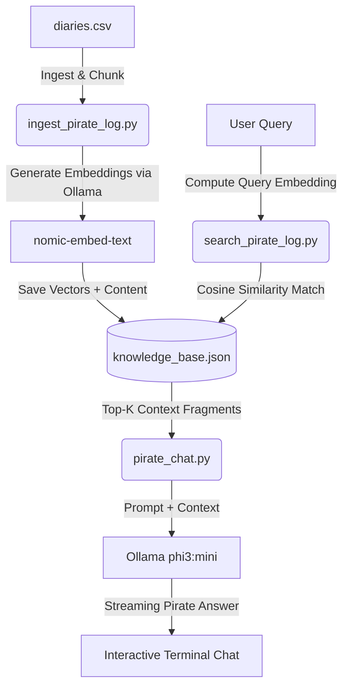

# ⚓ Talk to Your Notes: Local Pirate RAG Chat

A fully local **Retrieval-Augmented Generation (RAG)** system that allows you to chat with captain log diaries as if you were speaking directly to your grizzled pirate first mate. It runs entirely on your local machine using **Ollama**, ensuring complete data privacy and no external API costs.

---

## 🏴‍☠️ Features

- **Local Embeddings:** Uses the `nomic-embed-text` model via Ollama to convert raw pirate diaries into 768-dimensional vector coordinates.
- **Fast Vector DB:** Stores processed logs and embeddings in a lightweight local JSON database (`knowledge_base.json`).
- **Cosine Similarity Search:** Computes geometric similarity scores between user questions and ingested log chunks to find the most relevant entries.
- **Interactive Pirate Persona Chat:** Streams responses from `phi3:mini` acting as a seasoned pirate first mate, grounding its answers strictly in the retrieved logs.

---

## 🛠️ Architecture



---

## ⚙️ Prerequisites

1. **Python 3.8+**
2. **Ollama** installed and running on your system. [Download Ollama here](https://ollama.com/).
3. Pull the required models:
   ```bash
   ollama pull nomic-embed-text
   ollama pull phi3:mini
   ```

---

## 🚀 Getting Started

### 1. Install Dependencies
Install the required Python packages (only standard packages and `requests` are needed):
```bash
pip install requests
```

### 2. Ingest the Logs
Run the ingestion script to process the CSV logs from `pirate_notes/diaries.csv` and generate the vector database:
```bash
python ingest_pirate_log.py
```
*Note: For testing, the script is configured to process the first story quickly.*

### 3. Test Retrieval
You can test the cosine similarity search independently to see how logs are retrieved:
```bash
python search_pirate_log.py
```

### 4. Chat with Your Logs
Launch the interactive terminal chat loop to talk to your first mate:
```bash
python pirate_chat.py
```
Type `quit` to drop anchor and exit the chat.

---

## 📁 Project Structure

- `pirate_chat.py` - Main interactive CLI chat loop utilizing the RAG pipeline.
- `search_pirate_log.py` - Core logic for query embedding and cosine similarity retrieval.
- `ingest_pirate_log.py` - Prepares and embeds the CSV diaries into vector format.
- `pirate_notes/` - Directory containing the raw source data (`diaries.csv`).
- `knowledge_base.json` - The generated vector store map mapping text chunks to embeddings.
- `README.md` - Project documentation.
